# Manual de Usuario - SaludPlus

---

## 1. Introducción
En este manual se detalla el uso de la plataforma, para que cada usuario con su respectivo rol sepa como utilizar cada funiconalidad de su dashboard. Tanto como el iniciar sessión, registrarse y realizar citas para consultas con los distintos medicos y sus respectivas especialidades. 

---

## 2. Módulo de Paciente
Una vez los pacientes inicien sesión, se visualizará en la página principal los médicos que se han registrado en la plataforma exeptuando a los médicos con el cual esl paciente ya tiene programado una cita.

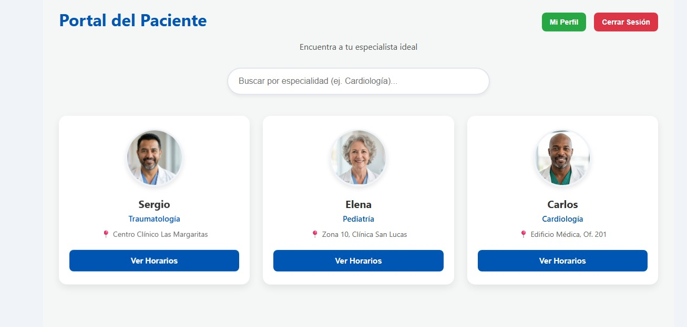

### 2.1 Registro y Acceso
*   **Pasos para registrarse:** Se debera llenar el formulario para los datos de registro del paciente. El único campo que no es obligatorio llenar es la de subida foto, este campo puede ser omitido si lo desea el paciente. Una vez se llene todo el formulario y se presione el botón de registrar, debera esperar hasta que el adminsitrador apruebe su registro, de lo contrario no podrá ingresar con las credenciales de `correo electronico` y `password` que registro el paciene en el formulario de registro.
   
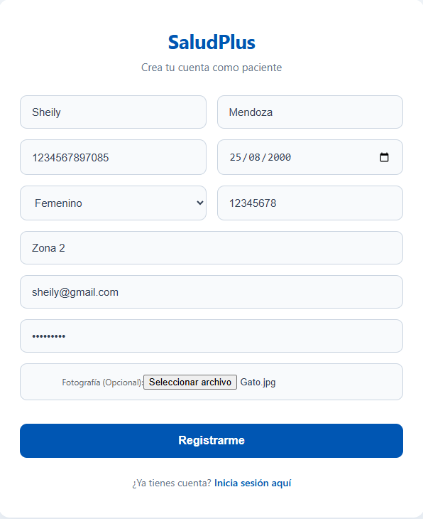

*   **Inicio de sesión:** Para poder ingresar a la plataforma como paciente el administrador debe de aprobar su registro, de lo contrario nunca podrá ingresar con las credenciales ingresadas en el formulario de registro.

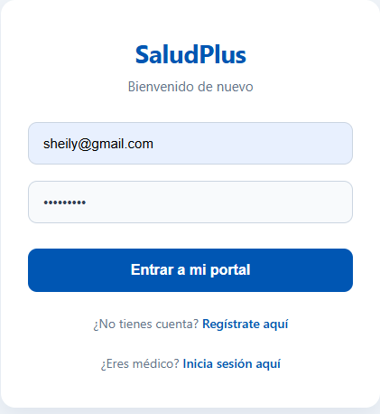

### 2.2 Gestión de Citas
*   **Búsqueda de médicos:**  El paciente tiene la opción de buscar médicos según su especialidad, para ello puede escribir la especialidad y dar click en un botón para realizar la búsqueda de los médicos por su especialidad. Al momento de visualizar el resultado de la búsqueda, se mostrara la información de los médicos para que el paciente pueda elegir al medico. Cuando se muestre la infomración del médico el paciente podrá ver los horarios donde el médico puede agendrale una cita.
  
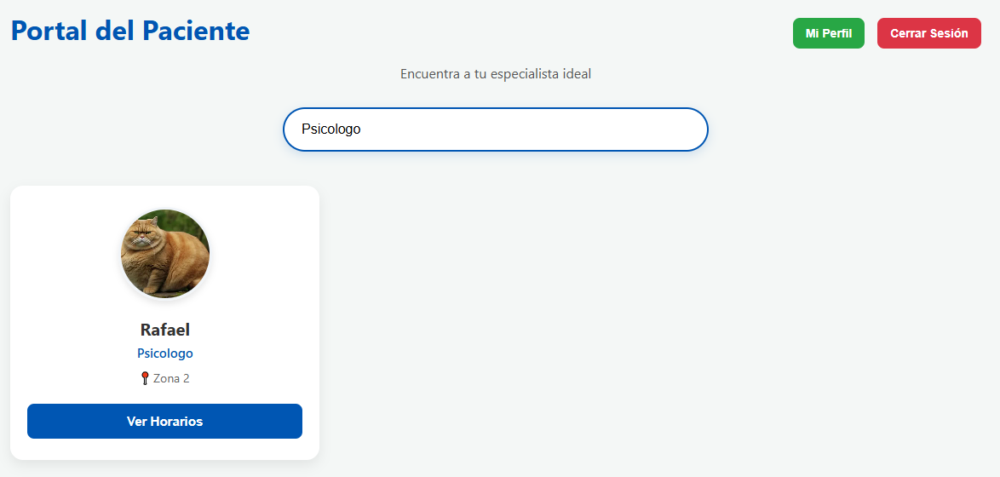

*   **Programar cita:** Cuado el paciente seleccione a un médico tendrá la opcion de programar una cita, llenando los datos que se solicitan en el formulario, datos como fecha de la cita, hora de la cita y el motivo de la cita. La cita se programará siempre y cuando el médico tenga espación en su horario, de lo contrario la cita no se programa.
  

* **Citas Activas:** El paciente tiene la opción de poder visualizar las citas a las que se ha registrado dentro de la plataforma y en las cuales aún no ha sido atendido.

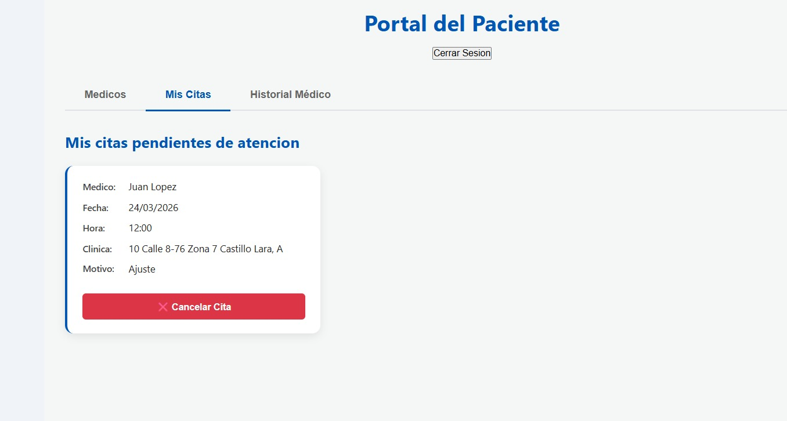

* **Historial de Citas:** El paciente podrá visualizar las citas a las ya ha sido atendido o las citas que se le han cancelado ya se por el mismo paciente o médico.

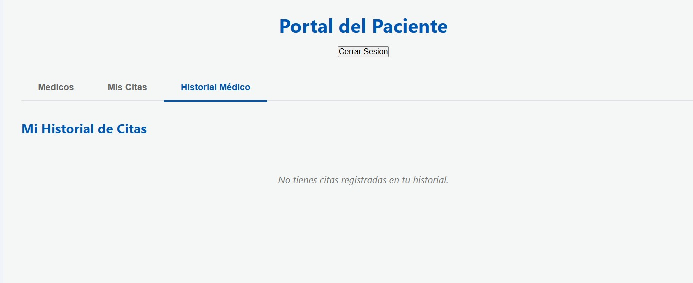

*   **Cancelar cita:** El paciente podrá cancelar su cita presionando el boton "Cancelar" la plataforma le preguntara si esta serguro de realizar esta acción, al realizar esta acción el paciente podrá ver la cita cancelada en el historial de citas.

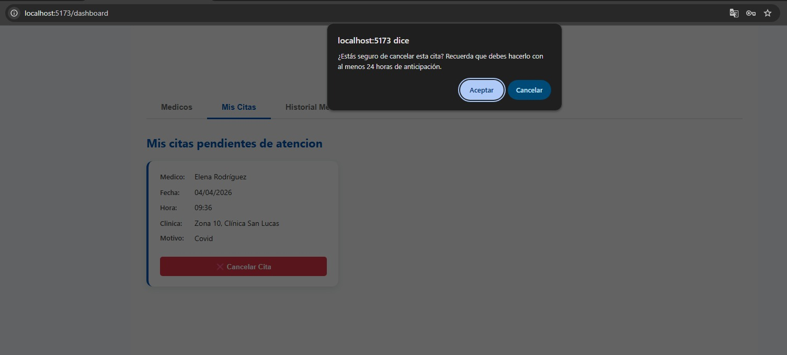

### 2.3 Perfil del Paciente
En esta parte el paciente podrá editar su perfil precionando el botón "Perfil o Editar Perfil", al poder visualizar los datos de su perfil el paciente podrá modificar los datos que haya colocado en su registro, exceptuando el correo electronico.
  
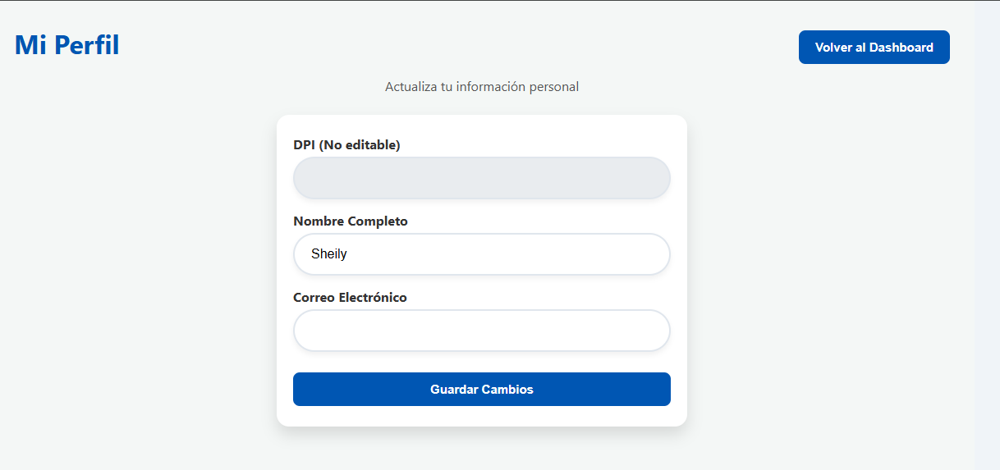

### 2.4 Prototipo Rol Paciente
Este es el prototipo en el que el equipo de desarrollo se baso para crear la plataforma para el Paciente:

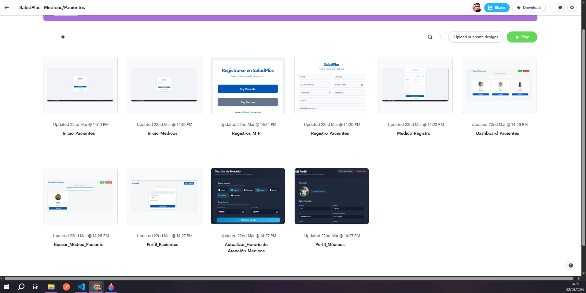

* **Link:** [Prototipo_Médicos](https://marvelapp.com/prototype/75fgcdh)

---

## 3. Módulo de Médico 
En este módulo el usuario de rol médico podrías ver su perfil profecional, gestionar citas con pacientes, acceder al historial de citas que atendió, cancelar citas a pacientes, enviar correos a pacientes y entre otras funciones.

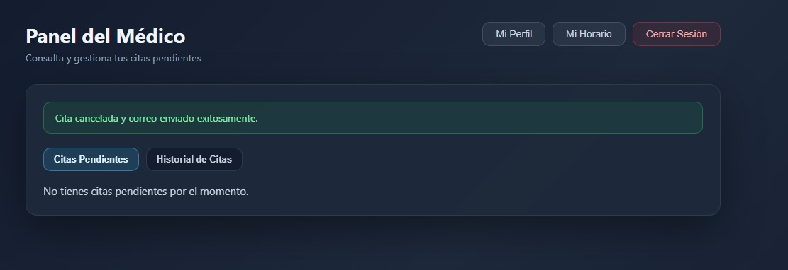

### 3.1 Registro y Acceso
*   **Pasos para registrarse:** Se debera llenar el formulario para los datos de registro del medico. En este rol todos los datos que se solicitan son de caracter obligatorio. Una vez se llene todo el formulario y se presione el botón de registrar, debera esperar hasta que el adminsitrador apruebe su registro, de lo contrario no podrá ingresar con las credenciales de `correo electronico` y `password` que registro el médico en el formulario de registro.
   
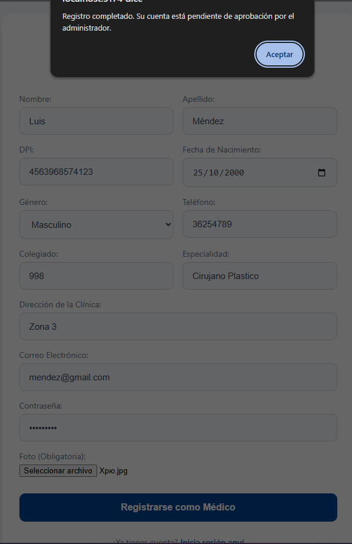

* **Login Médico:** Una vez que el adminsitrador válide la sólicitud se podrán ingresar las credenciales para iniciar sesión como médico.

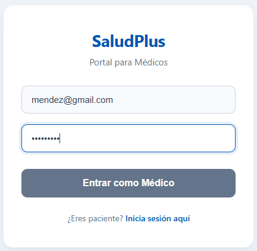

### 3.2 Gestión de Citas
*   **Establecer Horario de Atención:** Esta función el médico podrá establecer su horario de atención para que los pacientes puedan agendar una cita. El médico debera seleccionar el día o los días que atenderá a pacientes y deberá establecer el horario de atención.

*   **Atender paciente:** En esta función el médico podrá marcar al paciente como atendido una vez haya termiando la consulta, para realizar dicha acción el médico debera precionar el botón "Atendido" para llenar el formulario del tratamiento que el médico le recete al paciente. Una vez llenado el formulario del tratamiento el la cita desaparecera de la lista de citas pendientes.
   
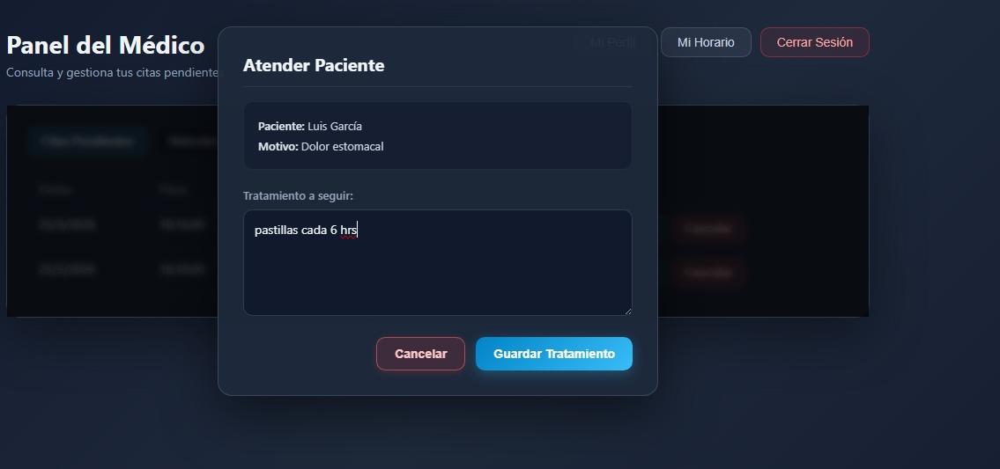

* **Actualizar Horario Atención:** Esta función el médico podrá editar el horario de en el que desea atender, estableciendo otra vez dias y hora. Y esperar a que el sistema válide que no existan citas pendietnes en el horario que el médico desea modificar. Debera de tener 0 citas pendientes como único requisito para modificar el horario de atención.

* **Historial de Citas del Médico:** Esta función le permite al médico visualizar la citas que ha atendido, cancelado o bien si el paciente la cancelo. Aquí el médio podrá llevar el control de los pacientes que ha atendido.

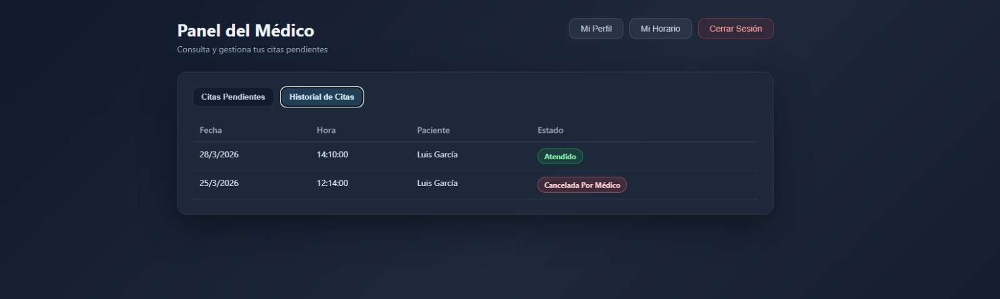

* **Ver y Actualizar Perfil Médico:** En esta función el médico al dar click en el botón "Editar Perfil o Perfil" podrá visualizar los datos de que llenó en el registro de medicos, el único dato que no podrá modificar sera el de correo electronico.

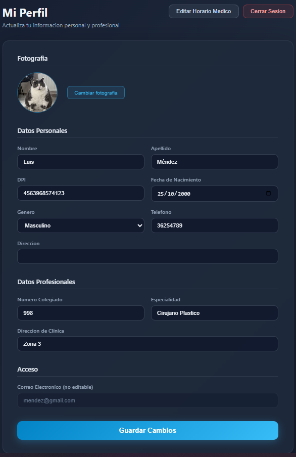

### 3.3 Notificaciones
* **Cancelar Citas del Paciente:** En esta función el médico podrá cancelar una cita siempore y cuando se le presenten inconvenientes, al cancelar una cita el médico ya no podrá visualizar en la lsita de pendientes y se le enviara un correo al paciente notificandole el motivo de la cancelación.

* **Envio de Correo a Pacientes:** Al momento de que el médico cancela una cita, se le enviará al paciente una notificación de cita cancelada, dicha notificación debera ser vía correo electrónico, en el correo de notificación el médico debera colocar: Fecha y hora cancelada, motivo de la cancelación, nombre del médico y el mensaje de disculpa.

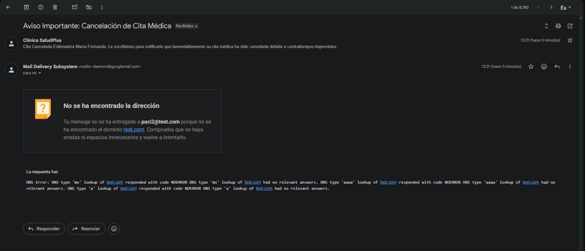

### 3.4 Prototipo Médicos
Este es el prototipo en el que el equipo de desarrollo se baso para crear la plataforma para el médico:

* **Link:** [Prototipo_Médicos](https://marvelapp.com/prototype/75fgcdh)

---

## 4. Módulo de Administrador
Este rol es el que adminstra los registros de pacientes y médicos en la plataforma los acepta o los rechaza, genera reportes sobre médicos que atienden más pacientes o la especialidad que tiene más demanda en el sistema. El rol administrador inicia sesión con un usuario y contraseña predeterminado, una vez que se inicie sesión con dichas credenciales devera hacer una autenticación `2FA`, la cual es nada menos que subir una contraseña encriptada y solamente al validar esta contraseña se podrá ingresar al dashboard del administrado.

### 4.1 Autenticación de Dos Factores (2FA)
* **Inicio de Sesión:** En esta parte el usuario con rol adminstrador devera ingresar las credenciales predeterminadas de ``usuario`` y ``contraseña``, las cuales son `admin` y `admin123` respectivamente.

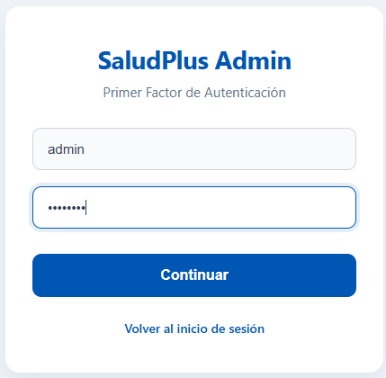

* **Autenticación 2FA:** Uso del archivo `auth2-ayd1.txt` para el segundo inicio de sesión el cual es utilizado para comparar la contraseña ingresada en la plataforma con el que esta registrado en la base de datos.

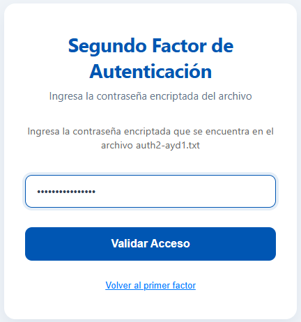

### 4.2 Aprobaciones y Bajas
*   **Gestión de usuarios:** Este rol tiene la función de aceptar o rechazar solicitudes de médicos y pacientes.

* **Ver Usuarios en el Sistema:** En esta sección el adminstrador podrá ver los médicos y pacientes a las culeas les fue aprobada la solicistud de registro.

* **Dar de baja:** En esta sección se podrá dar de baja al usuario `Médico/Paciente` y al precionar el boton `Dar de Baja` se eliminar de forma permanente del sistema.

### 4.3 Reportes Analíticos
En esta sección se podrá visualizar 2 tipos de reportes uan de `Gráfica de Barras` y otra de `Gráfcia Circular/Pie Chart`:

* **Gráfica de Barras:** Esta gráfica reportará a los médicos con más pacientes atendidos. Este reporte nacera de la acción del médico, cada vez que el médico finalice una consulta y le recete su tratamiento al paciente se agregar al medico con la cantidad de pacientes que atienda.

* **Pie Chart:** Esta gráfica reportará las especialidades con más demanda en el sistema. Este reporte nace de la acción del paciente, cada vez que el paciente agenda una cita se agregará dicha espcialidad elegida por el paciente a la gráfica.

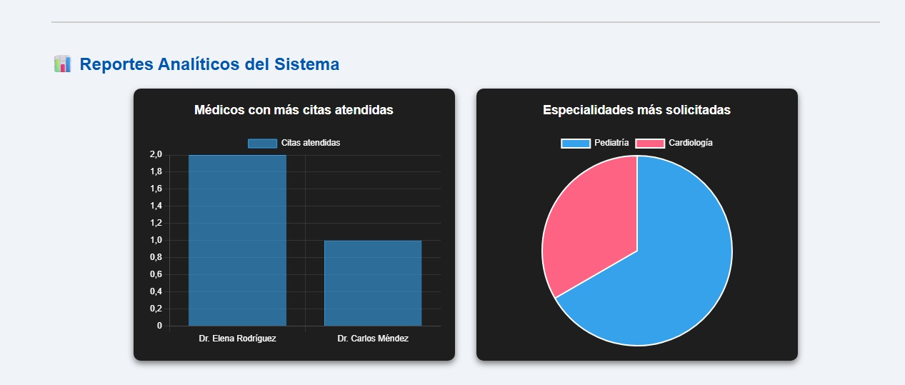

### 4.4 Prototipo Rol - Adminstrador
El siguiente prototifue fue realizado en la plataforma `Marvelapp.com`. Este prototipo ejemplifica de manera iteractiva lo que puede realizarse con el rol de `Administrador`, es fácil de utilizar y se puede interactuar con el prototipo accediendo al link debajo de la imagen:

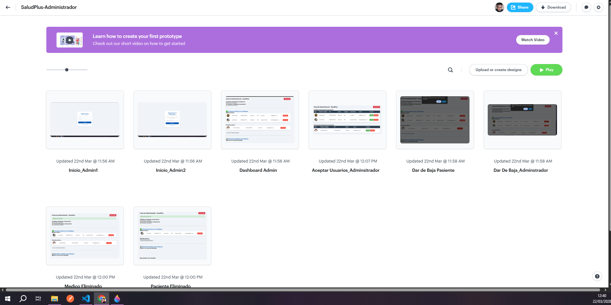

* **Link:** [Prototipo_Adminsitrador](https://marvelapp.com/prototype/35c270f6)
