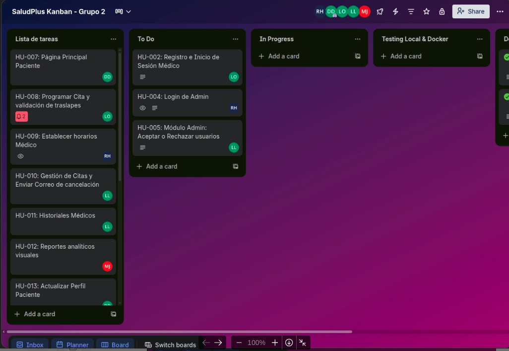
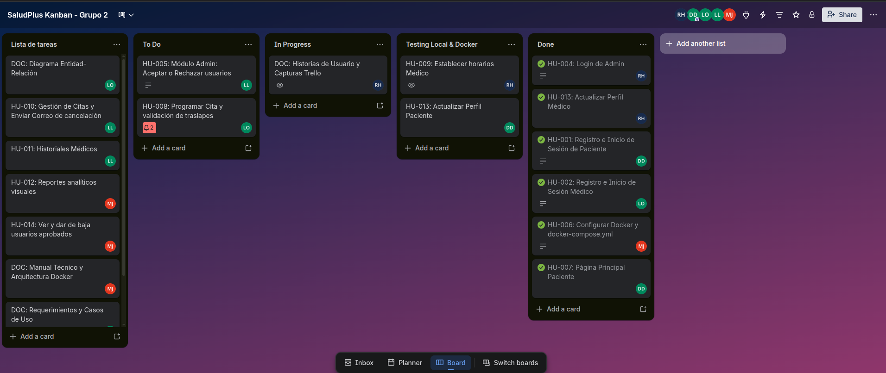
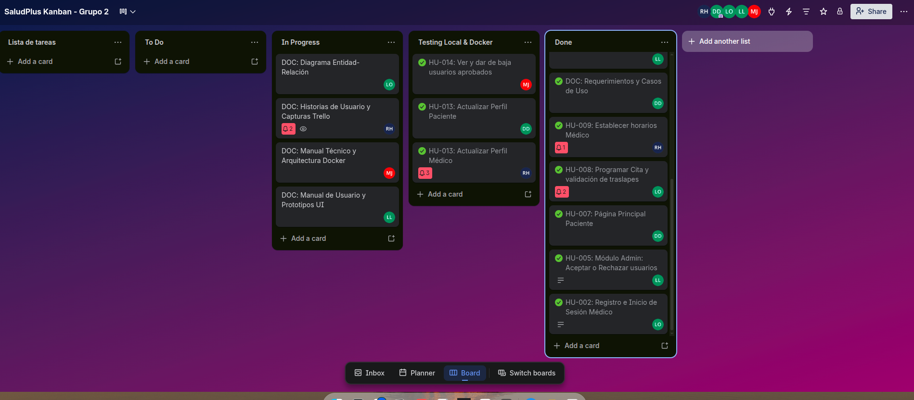

# **Gestión de Proyecto SCRUM - SaludPlus**

_Este documento centraliza la gestión ágil del proyecto, ceremonias, y evaluación del equipo, cumpliendo con los lineamientos del auxiliar._

---

## **1. Creación de Product Backlog**

**[Responsable: Carlos - Product Owner]**

- **HU-001 Registro de Paciente:** Formulario completo con validaciones y encriptación de contraseña.
- **HU-002 Registro de Médico:** Formulario con foto obligatoria, número colegiado y encriptación.
- **HU-003 Login Paciente/Médico:** Autenticación con validación de aprobación por administrador.
- **HU-004 Login Administrador (2FA):** Login con usuario/contraseña + validación de archivo `auth2-ayd1.txt` encriptado.
- **HU-005 Aceptar/Rechazar Usuarios:** Admin aprueba o rechaza registros de pacientes y médicos.
- **HU-006 Configuración Docker:** Dockerfiles y docker-compose para frontend, backend y base de datos local.
- **HU-007 Página Principal Paciente:** Ver lista de médicos disponibles con filtro por especialidad.
- **HU-008 Programar Cita:** Seleccionar médico, fecha, hora y motivo con validaciones de traslape.
- **HU-009 Establecer Horarios Médico:** El médico define días y rango horario de atención.
- **HU-010 Gestión de Citas Médico:** Ver citas pendientes, atender paciente con tratamiento, cancelar con email.
- **HU-011 Historial de Citas:** Paciente y médico ven citas atendidas y canceladas con estado.
- **HU-012 Generar Reportes Admin:** Mínimo 2 reportes con gráficos sobre uso de la plataforma.
- **HU-013 Ver y Actualizar Perfil:** Paciente y médico editan su perfil (excepto email).
- **HU-014 Ver/Dar de Baja Usuarios Admin:** Admin ve lista de aprobados y puede dar de baja con confirmación.

---

## **2. Sprint Planning**

### **Sprint Planning 1: Infraestructura y Autenticación**

- **Fecha:** 5 de Marzo de 2026
- **Duración:** 1 hora y 30 minutos.
- **Plataforma:** Google Meet
- **Grabación:** [https://drive.google.com/file/d/1HeVPfwh2a47QvBqi0e7tYFQNlqGvKOBZ/view?usp=sharing]
- **Fin Sprint 1:** 13/03/2026

#### **Roles Presentes:**

- Scrum Master: Marcelo (202010367)
- Product Owner: Carlos (202112109)
- Dev Team: Alex (201907608), Robert (201700870), Rafael (201903887)

#### **Story Points Comprometidos:**

21 Story Points Comprometidos - Sprint 1

#### **Decisiones Técnicas:**

- Framework Frontend: React + Vite
- Framework Backend: Node.js + Express
- Base de datos: PostgreSQL aislada en contenedor de Docker local
- Algoritmo de encriptación: bcryptjs
- Herramientas kanban: Trello

#### **Sprint Goal (Objetivo del Sprint 1):**

Al finalizar el Sprint 1, SaludPlus debe tener el módulo de autenticación completo (registro y login de pacientes, médicos y administrador con 2FA), la gestión de aprobaciones del administrador funcional, y la infraestructura Docker local totalmente operativa.

---

### **Sprint Planning 2: Lógica de Citas y Reportes**

- **Fecha:** 14 de Marzo de 2026
- **Duración:** 1 hora.
- **Plataforma:** Google Meet
- **Grabación:** [https://drive.google.com/file/d/1noKI_ytvwMadHz-ohu5AL-lSVRo8C_PD/view?usp=sharing]
- **Fin Sprint 2:** 22/03/2026

#### **Roles Presentes:**

- Scrum Master: Marcelo (202010367)
- Product Owner: Carlos (202112109)
- Dev Team: Alex (201907608), Robert (201700870), Rafael (201903887)

#### **Story Points Comprometidos:**

28 Story Points Comprometidos - Sprint 2

#### **Decisiones Técnicas:**

- Se implementará validación estricta de fechas desde el backend para evitar traslapes.
- Se usarán librerías de gráficos dinámicos en React para el panel del Administrador.

#### **Sprint Goal (Objetivo del Sprint 2):**

Completar la lógica central del negocio: agendamiento de citas sin traslapes, gestión de historiales por parte del médico y visualización de reportes gerenciales para el Administrador.

---

## **3. Sprint Backlog e Historias de Usuario**

**[Responsable: Robert]**
_Instrucción: Como las Historias de Usuario completas (con criterios de aceptación, formato "Como [actor]...", etc.) ocupan mucho espacio, se han documentado en un archivo Markdown separado._

**[Ver Documento Completo de Historias de Usuario](./Historias_de_Usuario.md)**

---

## **4. Daily Scrum**

**[Responsable: Marcelo (Scrum Master)]**

**[Ver Documento Completo de Daily Scrum](./Daily_Scrum.md)**

---

## **5. Sprint Retrospective**

### **Retrospectiva Sprint 1**

- **Fecha:** 13 de Marzo de 2026
- **Grabación:** [https://drive.google.com/drive/folders/1bHnDHGAe1PQo_cMJ3BeJ4fkfxL3q4wCV]
- **Resumen:**
  1. **¿Qué se hizo BIEN durante el Sprint?** La configuración de la infraestructura en Docker fue un éxito rotundo, permitiendo que todos programaran de forma local sin problemas de dependencias. La comunicación para integrar el Frontend y el Backend en los logins fue muy fluida.
  2. **¿Qué se hizo MAL durante el Sprint?** Tuvimos una leve curva de aprendizaje con las reglas estrictas de GitFlow, lo que provocó pequeñas confusiones al momento de nombrar las ramas y hacer los Conventional Commits.
  3. **¿Qué MEJORAS implementaremos en el Sprint 2?** Revisaremos minuciosamente que la rama base de los Pull Requests sea siempre `develop` y no `main` antes de fusionar.

### **Retrospectiva Sprint 2**

- **Fecha:** 22 de Marzo de 2026
- **Grabación:** [https://drive.google.com/drive/folders/1bHnDHGAe1PQo_cMJ3BeJ4fkfxL3q4wCV]
- **Resumen:**
  1. **¿Qué se hizo BIEN durante el Sprint?** Se logró terminar la lógica compleja de evitar traslapes en las citas y el flujo de los reportes dentro del tiempo límite. El equipo logró acoplarse perfectamente al ritmo acelerado de 9 días por Sprint.
  2. **¿Qué se hizo MAL durante el Sprint?** Al juntar todas las partes visuales al final, tuvimos que invertir tiempo extra estandarizando estilos CSS que no se planificaron desde el inicio.
  3. **¿Qué MEJORAS implementaremos?** Definir componentes UI globales estandarizados desde el Sprint 1 para ahorrar tiempo en la fase final de integración.

**Carpeta de grabaciones:** [https://drive.google.com/drive/folders/1bHnDHGAe1PQo_cMJ3BeJ4fkfxL3q4wCV?usp=drive_link]
---

## **6. Gestión en Tablero Kanban**

**[Responsable: Robert y Carlos]**
_Instrucción: Colocar el link público del tablero y las 3 capturas obligatorias exigidas en la rúbrica._

- **Link del Tablero Oficial:** [https://trello.com/b/9fC86mox/saludplus-kanban-grupo-2]

**Evidencias del Progreso (Capturas):**

1. **Inicio del Proyecto/Sprint 1:**
   
2. **Durante el Desarrollo (Medio):**
   
3. **Final del Proyecto (Sprint 2):**
   

---

## **7. Evaluación del Equipo**

**Scrum Master:** Marcelo (202010367)

- **Calificación del Equipo de Desarrollo:** **100 / 100**
- **Justificación de la Calificación:**
  Como Scrum Master, le otorgo la máxima calificación al equipo completo por su nivel de excelencia técnica, adaptabilidad y compromiso. Trabajar bajo un cronograma acelerado de 18 días representaba un reto enorme que se superó con éxito gracias a la dedicación de cada integrante:
  - **Carlos (Product Owner):** Llevó un control impecable del tablero Kanban, organizando las prioridades de tal forma que nunca hubo bloqueos y redactando documentación precisa.
  - **Alex y Robert (Development Team):** Demostraron habilidades analíticas sobresalientes al resolver la lógica de traslape de citas y la integración de seguridad (2FA y manejo de archivos), aportando código limpio e Historias de Usuario muy bien estructuradas.
  - **Rafael (Development Team):** Elevó la calidad del proyecto con prototipos intuitivos, conectando de forma impecable el frontend con el backend y entregando manuales de altísima calidad.

  El equipo respetó sin excepciones la regla de oro de la arquitectura "Local First" mediante Docker y el flujo de trabajo GitFlow. La proactividad, la comunicación diaria (Dailies) y la resolución ágil de bugs nos permitieron llegar al Release del 23 de marzo con un producto estable, documentado y 100% funcional.
