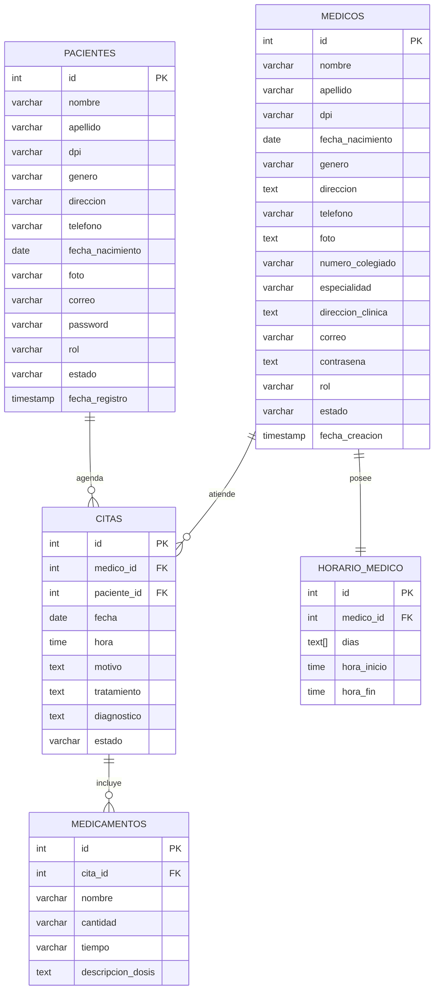

# Diagrama Entidad-Relación de la Base de Datos

## Descripción general
Este documento describe el modelo entidad-relación de la base de datos del sistema médico.  
El esquema está compuesto por cinco entidades principales:

- **pacientes**
- **medicos**
- **citas**
- **horario_medico**
- **medicamentos**

Estas tablas permiten registrar pacientes, médicos, citas médicas, el horario asignado a cada médico y los medicamentos recetados por cita (HU-203).

---

## Diagrama ER

---

## Explicación de las entidades

### 1. Tabla `pacientes`
La tabla **pacientes** almacena la información de las personas que solicitan o reciben atención médica dentro del sistema.  
Cada paciente tiene un identificador único (`id`) y datos personales como nombre, apellido, DPI, género, dirección, teléfono, fecha de nacimiento, correo y contraseña.

Campos importantes:
- **id**: llave primaria.
- **dpi**: único para cada paciente.
- **correo**: único para cada paciente.
- **password**: contraseña de acceso.
- **rol**: por defecto toma el valor `paciente`.
- **estado**: indica la situación actual del registro.
- **fecha_registro**: almacena la fecha y hora de creación.

---

### 2. Tabla `medicos`
La tabla **medicos** almacena la información de los doctores registrados en el sistema.  
Contiene datos personales, profesionales y de contacto.

Campos importantes:
- **id**: llave primaria.
- **dpi**: único por médico.
- **numero_colegiado**: identificador profesional único.
- **especialidad**: área médica del profesional.
- **correo**: único por médico.
- **contrasena**: credencial de acceso.
- **rol**: por defecto toma el valor `medico`.
- **estado**: permite controlar la disponibilidad o aprobación del médico.
- **fecha_creacion**: registra cuándo fue creado el usuario médico.

---

### 3. Tabla `citas`
La tabla **citas** representa la relación entre pacientes y médicos.  
Aquí se registran las consultas médicas programadas.

Campos importantes:
- **id**: llave primaria.
- **medico_id**: llave foránea que referencia a `medicos(id)`.
- **paciente_id**: llave foránea que referencia a `pacientes(id)`.
- **fecha**: día de la cita.
- **hora**: hora de la cita.
- **motivo**: razón de la consulta.
- **tratamiento**: campo legado de texto libre (Fase 1).
- **diagnostico**: diagnóstico estructurado registrado por el médico al atender (HU-203).
- **estado**: estado actual de la cita (`activa`, `Atendido`, `Cancelada por médico`, `Cancelada por paciente`).

Interpretación:
- Un **paciente** puede tener muchas **citas**.
- Un **médico** puede atender muchas **citas**.
- Cada **cita** pertenece a un solo paciente y a un solo médico.
- Una **cita atendida** puede tener uno o más **medicamentos** asociados.

---

### 4. Tabla `medicamentos`
La tabla **medicamentos** almacena los medicamentos recetados por el médico al atender una cita (HU-203).  
Cada registro representa un medicamento individual dentro de una receta médica.

Campos importantes:
- **id**: llave primaria.
- **cita_id**: llave foránea que referencia a `citas(id)`. Se elimina en cascada si se borra la cita.
- **nombre**: nombre del medicamento (ej. Metformina, Tylenol).
- **cantidad**: presentación o cantidad recetada (ej. 1 caja, 2 frascos).
- **tiempo**: duración del tratamiento (ej. 15 días, 1 mes).
- **descripcion_dosis**: instrucciones de uso (ej. Tomar 1 pastilla cada 8 horas).

Detalle importante:
- Una cita puede tener **uno o más** medicamentos, lo que modela una relación **uno a muchos** entre `citas` y `medicamentos`.

---

### 5. Tabla `horario_medico`
La tabla **horario_medico** almacena la disponibilidad de cada médico.  
Permite definir los días y el rango horario en que un médico atiende.

Campos importantes:
- **id**: llave primaria.
- **medico_id**: llave foránea hacia `medicos(id)`.
- **dias**: arreglo de días de atención.
- **hora_inicio**: hora de inicio de atención.
- **hora_fin**: hora de finalización.

Detalle importante:
- El campo **medico_id** es **UNIQUE**, lo cual indica que un médico solo puede tener un horario registrado en esta tabla.
- Esto modela una relación **uno a uno** entre `medicos` y `horario_medico`.

---

## Relaciones del modelo

### Relación entre `pacientes` y `citas`
- Tipo: **uno a muchos**
- Explicación: un paciente puede agendar varias citas, pero cada cita pertenece a un solo paciente.

### Relación entre `medicos` y `citas`
- Tipo: **uno a muchos**
- Explicación: un médico puede atender varias citas, pero cada cita está asociada a un solo médico.

### Relación entre `medicos` y `horario_medico`
- Tipo: **uno a uno**
- Explicación: cada médico tiene un único horario registrado, y cada horario pertenece a un solo médico.

### Relación entre `citas` y `medicamentos`
- Tipo: **uno a muchos**
- Explicación: una cita atendida puede tener uno o más medicamentos recetados. Cada medicamento pertenece a una sola cita. Si la cita se elimina, sus medicamentos se eliminan en cascada.

---

## Resumen del modelo ER
El modelo está diseñado para gestionar un sistema de citas médicas de forma estructurada.  
Las entidades principales son pacientes y médicos, mientras que la tabla de citas funciona como entidad intermedia para conectar a ambos.  
Además, la tabla de horario médico complementa la información del profesional, permitiendo definir su disponibilidad de atención.  
A partir de la Fase 2 (HU-203), se incorpora la tabla de medicamentos para registrar el tratamiento estructurado al momento de atender una cita.

Este diseño permite:
- registrar pacientes y médicos,
- programar citas entre ambos,
- controlar el horario disponible de cada médico,
- y registrar diagnósticos y medicamentos estructurados por cita atendida.
