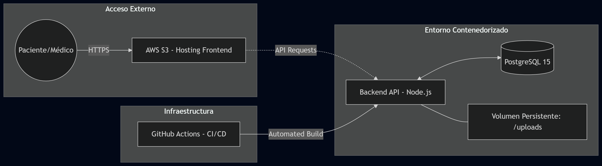
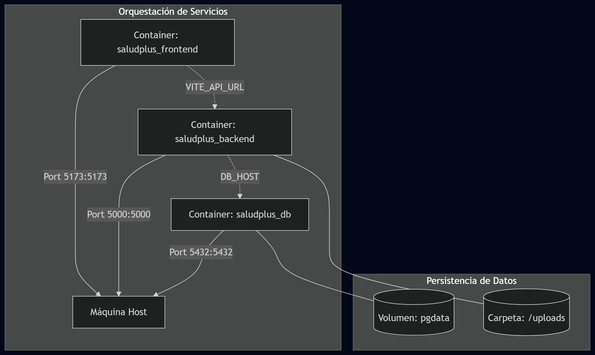
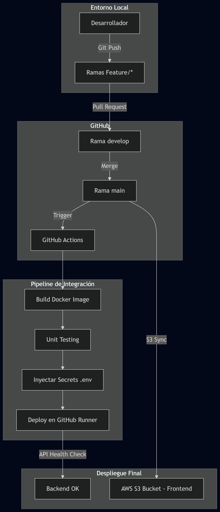

# 📘 Manual Técnico: Plataforma SaludPlus (Fase 2)

## 1. Introducción

Este documento detalla la arquitectura, configuración y procesos técnicos de la plataforma SaludPlus. En esta segunda fase, el sistema ha evolucionado para incluir validaciones de seguridad avanzadas, gestión estructurada de tratamientos médicos y un pipeline de integración continua para asegurar la calidad del software.

## 2. Arquitectura de Sistema y Contenedores

SaludPlus utiliza una arquitectura de microservicios contenedorizados para garantizar la paridad de entornos y la escalabilidad.

### 2.1. Diagrama de Arquitectura General

Este diagrama representa la interacción entre el usuario, el despliegue en la nube y los servicios internos de la aplicación.

[](./img/Arqui_General.png)

### 2.1.1 Componentes Principales

1. **Frontend (Capa de Presentación):** Aplicación SPA desarrollada en React.js y Vite, desplegada de forma estática en **AWS S3**.
2. **Backend (Lógica de Negocio):** API REST construida con Node.js y Express, ejecutada dentro de contenedores Docker.
3. **Base de Datos (Persistencia):** PostgreSQL 15 orquestado mediante Docker con volúmenes persistentes (`pgdata`) para resguardar la información médica.

### 2.2. Diagrama de Arquitectura de Contenedores

Este diagrama detalla la comunicación entre los contenedores de Frontend, Backend y Base de Datos, así como el almacenamiento persistente para los archivos de identidad.
[](./img/Arqui_Contenedores.png)

### 2.2.1 Componentes Detallados

1. **Contenedor Frontend:** Expone el puerto 5173 para servir la aplicación React.
2. **Contenedor Backend:** Expone el puerto 5000 para la API REST y maneja la lógica de negocio, incluyendo autenticación y gestión de citas.
3. **Contenedor PostgreSQL:** Expone el puerto 5432 para la conexión a la base de datos, con un volumen `pgdata` para asegurar la persistencia de los datos.
4. **Volumen `uploads`:** Sincroniza la carpeta de almacenamiento de DPIs y CVs entre el contenedor Backend y el host, garantizando que los documentos de identidad no se pierdan al reiniciar los contenedores.

---

## 3. Organización del Proyecto

El repositorio sigue una estructura modular para separar responsabilidades y facilitar el mantenimiento.

```text
AYD1-Fase2_G2/
├── .github/workflows/       # Configuración de GitHub Actions (CI/CD)
├── backend/                 # API REST y lógica de servidor
│   ├── src/
│   │   ├── config/          # Conexiones a BD y utilidades (Multer)
│   │   ├── controllers/     # Lógica de negocio (Auth, Citas, Médicos)
│   │   ├── middlewares/     # Protectores de rutas (JWT)
│   │   ├── routes/          # Definición de Endpoints
│   │   └── uploads/         # Almacenamiento de DPIs, CVs y fotos (Persistente)
│   ├── Dockerfile           # Receta de construcción del contenedor Backend
│   └── package.json         # Dependencias de Node.js
├── frontend/                # Aplicación cliente en React
│   ├── src/
│   │   ├── pages/           # Vistas (Login, Dashboards, Registro)
│   │   └── styles/          # Hojas de estilo CSS
│   ├── Dockerfile           # Configuración Docker para el Frontend
│   └── vite.config.js       # Configuración del empaquetador Vite
├── database/
│   └── init.sql             # Script de inicialización y esquema de BD
└── docker-compose.yml       # Orquestador de servicios
```

---

## 4. Ciclo de Vida del Código y CI/CD

Se implementó una estrategia de **Git Flow** y un pipeline automatizado para elevar los estándares de calidad.

### 4.1. Pipeline de GitHub Actions

El flujo se activa automáticamente al realizar un `push` a la rama `main`, ejecutando las siguientes etapas:

1. **Build:** Construcción de imágenes Docker para detectar errores de sintaxis o dependencias faltantes.
2. **Test:** Ejecución de pruebas unitarias dentro del contenedor para validar la lógica crítica (ej. generación de tokens).
3. **Deploy (Simulado):** Levantamiento de servicios en el GitHub Runner para verificar la disponibilidad de la API.

[](./img/pipeline.png)

---

## 5. Guía de Instalación y Despliegue Local

### 5.1. Requisitos Previos

- Docker y Docker Compose instalados.
- Git para control de versiones.
- Puertos disponibles: 5000 (Backend), 5173 (Frontend), 5432 (Postgres).

### 5.2. Pasos para Levantar el Proyecto

1. **Clonar el repositorio:** `git clone https://github.com/MarceJua/AYD1-Fase1S2026_SeccionB_G2.git`
2. **Configurar variables:** Crear un archivo `.env` en la raíz con las credenciales de BD y Nodemailer.
3. \*\*Ejecutar contenedores:

   `docker compose up --build -d`

4. **Verificación:** Acceder a `http://localhost:5173` para el portal de usuarios.

---

## 6. Decisiones Técnicas Destacadas (Fase 2)

- **Validación 2FA por Token:** Uso de tokens alfanuméricos únicos para verificar la validez de los correos electrónicos registrados.
- **Visor PDF Embebido:** Implementación de `<iframe>` para visualizar DPIs y CVs sin descargas previas en el panel de administrador.
- **Persistencia de Archivos:** Uso de volúmenes de Docker para sincronizar la carpeta `uploads` con el host, evitando pérdida de documentos de identidad.
- **Pipeline CI/CD:** Automatización de pruebas y despliegue para garantizar la estabilidad del sistema en cada actualización.
- **Seguridad Mejorada:** Implementación de JWT para proteger rutas sensibles y asegurar la autenticidad de las sesiones de usuario.
- **Gestión de Tratamientos Médicos:** Estructuración de la base de datos para almacenar y gestionar tratamientos médicos asociados a cada paciente, permitiendo un seguimiento detallado de su historial clínico.

---
